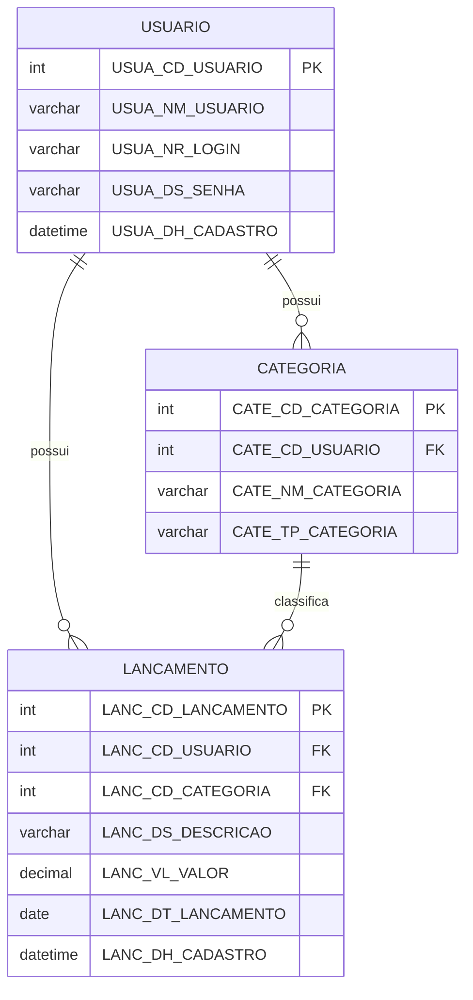

# DEV & LUXANDO

## Sistema de Gestão de Finanças

# Projeto de Banco de Dados "Sistema de Gestão de Finanças Pessoais"

**Instituição:** INSTITUTO FEDERAL DE EDUCAÇÃO, CIÊNCIA E TECNOLOGIA DE RONDÔNIA
**Campus:** Vilhena
**Aluno(s):** _preencher_
**Vilhena/RO | 2026**

---

## 1. Análise de Caso

Este documento descreve o banco de dados que dá suporte ao Sistema de Gestão de Finanças Pessoais, desenvolvido em Node.js + TypeScript com persistência em SQLite. O objetivo é apresentar o minimundo, as regras de negócio, o dicionário de dados e as constraints do banco, seguindo o padrão de nomenclatura e normalização adotado na disciplina de Banco de Dados I.

## 2. Minimundo

O sistema permite que uma pessoa controle suas finanças pessoais de forma individual. Cada usuário possui um login próprio e pode cadastrar categorias (por exemplo, "Alimentação", "Salário", "Transporte") classificadas como receita ou despesa. A partir dessas categorias, o usuário registra lançamentos financeiros com valor e data, podendo depois consultar um resumo mensal com o total de receitas, despesas e saldo, agrupado por categoria.

O sistema é de uso individual por usuário: cada um enxerga e movimenta apenas seus próprios dados (categorias e lançamentos), identificados pelo login.

## 3. Técnica de Levantamento de Requisitos

- **Técnica escolhida:** Entrevista informal com potenciais usuários do sistema.
- **Como foi aplicada:** Levantamento das necessidades básicas de controle financeiro pessoal (o que uma pessoa comum precisa registrar para saber para onde vai o dinheiro).
- **Usuários do sistema:** Pessoas físicas que desejam controlar receitas e despesas mensais organizadas por categoria.

## 4. Regras de Negócio

- Todo usuário possui um login único no sistema.
- A senha do usuário nunca é armazenada em texto puro, apenas seu hash.
- Toda categoria pertence a exatamente um usuário (categorias não são compartilhadas entre usuários).
- Não é permitido cadastrar duas categorias com o mesmo nome para o mesmo usuário.
- Toda categoria possui um tipo fixo: `RECEITA` ou `DESPESA`.
- Todo lançamento financeiro pertence a um usuário e a uma categoria desse mesmo usuário.
- O valor de um lançamento é sempre positivo; o tipo do lançamento (receita/despesa) é definido pela categoria associada, nunca duplicado no lançamento.
- O mês de referência de um lançamento é derivado da sua data (`AAAA-MM`), não é armazenado em campo separado.

## 5. Problemas que o Sistema Resolve

- Falta de visibilidade sobre para onde o dinheiro está indo mês a mês.
- Dificuldade de separar gastos por categoria sem uma planilha manual.
- Ausência de um saldo consolidado (receitas − despesas) por período.

## 6. Informações Armazenadas

- Dados de identificação e acesso do usuário (nome, login, senha).
- Categorias financeiras cadastradas por cada usuário, com seu tipo (receita/despesa).
- Lançamentos financeiros: valor, data, descrição e a categoria/usuário aos quais pertencem.

## 7. Fluxo de Atividades

1. Usuário se registra no sistema (login, senha, nome).
2. Usuário efetua login com login e senha.
3. Usuário cadastra as categorias que deseja usar (ex.: Alimentação/Despesa, Salário/Receita).
4. Usuário registra lançamentos, associando cada um a uma categoria já cadastrada.
5. Usuário consulta o resumo mensal, obtendo totais por categoria, total de receitas, total de despesas e saldo.

## 8. Requisitos do Sistema

### Requisitos Funcionais
- RF01: O sistema deve permitir o cadastro de um novo usuário com login único.
- RF02: O sistema deve autenticar um usuário por login e senha.
- RF03: O sistema deve permitir o cadastro de categorias por usuário, com tipo receita ou despesa.
- RF04: O sistema deve impedir categorias duplicadas (mesmo nome) para um mesmo usuário.
- RF05: O sistema deve permitir o registro de lançamentos financeiros vinculados a uma categoria do usuário.
- RF06: O sistema deve gerar um resumo mensal com total por categoria, total de receitas, total de despesas e saldo.

### Requisitos Não Funcionais
- RNF01: Os dados devem ser persistidos em um arquivo SQLite local, sem necessidade de servidor de banco de dados.
- RNF02: A senha do usuário deve ser armazenada apenas como hash (bcrypt).
- RNF03: A interação com o sistema deve ocorrer via linha de comando (argumentos).
- RNF04: O banco deve manter integridade referencial entre usuário, categoria e lançamento.

## 9. Modelo de Dados

### 9.1 Diagrama Lógico



> Diagrama gerado a partir do script `db/schema.sql`. Como o banco é SQLite (não MySQL), o diagrama lógico não é gerado via MySQL Workbench — o diagrama acima (Mermaid) cumpre o mesmo papel de representação lógica das tabelas e relacionamentos.

### 9.2 Dicionário de Dados (DED)

**Tabela: USUARIO (alias USUA)**

| Campo | Tipo SQL | Tipo da Variável | Opções da Coluna | Descrição |
|---|---|---|---|---|
| USUA_CD_USUARIO | INTEGER | PK | NOT NULL | Código identificador do usuário |
| USUA_NM_USUARIO | VARCHAR(100) | Simples | NOT NULL | Nome do usuário |
| USUA_NR_LOGIN | VARCHAR(50) | Simples | NOT NULL, UNIQUE | Login usado para autenticação |
| USUA_DS_SENHA | VARCHAR(255) | Simples | NOT NULL | Hash da senha do usuário |
| USUA_DH_CADASTRO | DATETIME | Simples | NOT NULL, DEFAULT CURRENT_TIMESTAMP | Data e hora do cadastro |

**Tabela: CATEGORIA (alias CATE)**

| Campo | Tipo SQL | Tipo da Variável | Opções da Coluna | Descrição |
|---|---|---|---|---|
| CATE_CD_CATEGORIA | INTEGER | PK | NOT NULL | Código identificador da categoria |
| CATE_CD_USUARIO | INTEGER | FK | NOT NULL | Usuário dono da categoria |
| CATE_NM_CATEGORIA | VARCHAR(50) | Simples | NOT NULL | Nome da categoria |
| CATE_TP_CATEGORIA | VARCHAR(20) | Simples | NOT NULL | Tipo da categoria: RECEITA ou DESPESA |

**Tabela: LANCAMENTO (alias LANC)**

| Campo | Tipo SQL | Tipo da Variável | Opções da Coluna | Descrição |
|---|---|---|---|---|
| LANC_CD_LANCAMENTO | INTEGER | PK | NOT NULL | Código identificador do lançamento |
| LANC_CD_USUARIO | INTEGER | FK | NOT NULL | Usuário dono do lançamento |
| LANC_CD_CATEGORIA | INTEGER | FK | NOT NULL | Categoria do lançamento |
| LANC_DS_DESCRICAO | VARCHAR(255) | Simples | NULL | Descrição livre do lançamento |
| LANC_VL_VALOR | DECIMAL(10,2) | Simples | NOT NULL | Valor do lançamento |
| LANC_DT_LANCAMENTO | DATE | Simples | NOT NULL | Data efetiva do lançamento |
| LANC_DH_CADASTRO | DATETIME | Simples | NOT NULL, DEFAULT CURRENT_TIMESTAMP | Data e hora em que o lançamento foi registrado no sistema |

### 9.3 Resumo das Constraints

**Primary Keys**
- `PK_USUARIO` — USUARIO (USUA_CD_USUARIO)
- `PK_CATEGORIA` — CATEGORIA (CATE_CD_CATEGORIA)
- `PK_LANCAMENTO` — LANCAMENTO (LANC_CD_LANCAMENTO)

**Foreign Keys**
- `FK_CATEGORIA_USUARIO` — CATEGORIA (CATE_CD_USUARIO) → USUARIO (USUA_CD_USUARIO)
- `FK_LANCAMENTO_USUARIO` — LANCAMENTO (LANC_CD_USUARIO) → USUARIO (USUA_CD_USUARIO)
- `FK_LANCAMENTO_CATEGORIA` — LANCAMENTO (LANC_CD_CATEGORIA) → CATEGORIA (CATE_CD_CATEGORIA)

**Unique Keys**
- `UK_USUARIO_NR_LOGIN` — USUARIO (USUA_NR_LOGIN)
- `UK_CATEGORIA_CD_USUARIO_NM_CATEGORIA` — CATEGORIA (CATE_CD_USUARIO, CATE_NM_CATEGORIA)

**Índices**
- `IX_CATEGORIA_01` — CATEGORIA (CATE_CD_USUARIO)
- `IX_LANCAMENTO_01` — LANCAMENTO (LANC_CD_USUARIO)
- `IX_LANCAMENTO_02` — LANCAMENTO (LANC_CD_CATEGORIA)

### 9.4 Normalização

- **1FN:** todos os campos são atômicos (nenhum campo guarda lista ou múltiplos valores); não há repetição de grupos de colunas.
- **2FN:** todas as tabelas usam chave primária simples (surrogate key de uma coluna), logo não há dependência parcial possível.
- **3FN:** nenhum atributo não-chave depende de outro atributo não-chave. Em particular, o tipo (receita/despesa) e o dono de um lançamento não são duplicados em LANCAMENTO — são obtidos por meio das chaves estrangeiras `LANC_CD_CATEGORIA` e `LANC_CD_USUARIO`, evitando dependência transitiva.

## 10. Observações de Adaptação (MySQL → SQLite)

O padrão de nomenclatura, PK/FK/UK/índices e normalização (3FN) foi seguido integralmente. Como a persistência é feita em **SQLite** (arquivo local, via `node:sqlite`) e não em MySQL, alguns pontos específicos de sintaxe MySQL foram adaptados:

- Não existe `CREATE DATABASE` / `USE` em SQLite — o "banco" é o próprio arquivo `gestao_financeira.db` (nome em minúsculas, conforme padrão de nomenclatura de banco/schema).
- `CHARACTER SET` / `COLLATE utf8mb4` não se aplicam ao SQLite (SQLite é UTF-8 por padrão).
- O incremento automático da chave primária é obtido pelo comportamento nativo de `INTEGER PRIMARY KEY` do SQLite (ROWID), mantendo a constraint nomeada `PK_<TABELA>` em vez da palavra-chave `AUTO_INCREMENT`/`AUTOINCREMENT`, que em SQLite só é aceita na forma de coluna inline (`INTEGER PRIMARY KEY AUTOINCREMENT`) e não como constraint nomeada.
- `DECIMAL(10,2)` e `TINYINT(1)` são aceitos na sintaxe de criação de tabela (SQLite usa "type affinity"), mesmo sem a validação estrita de precisão que o MySQL faz.
- O diagrama lógico (item 9.1) foi gerado em Mermaid a partir do script, no lugar do MySQL Workbench.

## 11. Estrutura do Projeto

```
db/
  schema.sql              # script de criação das tabelas (sem comentários, pronto para execução)
src/
  types.ts                # interfaces TypeScript do domínio
  db.ts                   # conexão SQLite + aplicação do schema
  repositories/           # acesso a dados por tabela
  services/                # regras de negócio (autenticação, resumo financeiro)
  cli.ts                   # comandos de linha de comando (commander)
  index.ts                 # ponto de entrada
```

## 12. Como Executar

O sistema é interativo: ao rodar `npm start`, ele pergunta primeiro se você já possui
uma conta e conduz o cadastro/login respondendo perguntas no terminal (nome, login,
senha, categoria, valor, data etc.), em vez de passar argumentos via linha de comando.

```bash
npm install
npm start
```

Fluxo típico:

```
=== Sistema de Gestão de Finanças Pessoais ===
Você já possui uma conta? (S/N, ou 0 para sair): N
Nome: Aa Aa
Login: aa
Senha: 123456
Usuário "Aa Aa" cadastrado com sucesso!

--- Menu (Aa Aa) ---
1. Criar categoria
2. Listar categorias
3. Registrar lançamento
4. Resumo mensal
5. Sair da conta
0. Encerrar programa
Escolha uma opção: 1
Nome da categoria: Alimentacao
Tipo (1-Receita / 2-Despesa): 2
```

Se responder `S`, o sistema pede apenas login e senha (fluxo de login).

### Seed (dados de exemplo)

Para popular o banco com um usuário e dados de teste prontos, sem precisar cadastrar
tudo manualmente:

```bash
npm run seed
```

Isso cria (ou reaproveita, se já existir) o usuário `demo` / senha `123456`, com
categorias (Salario, Freelance, Alimentacao, Transporte, Lazer) e alguns lançamentos
de agosto/2026. É seguro rodar mais de uma vez: não duplica usuário, categorias nem
lançamentos.
